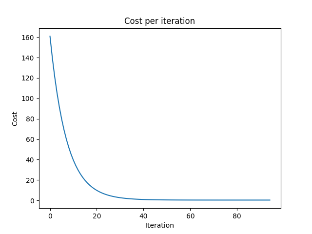
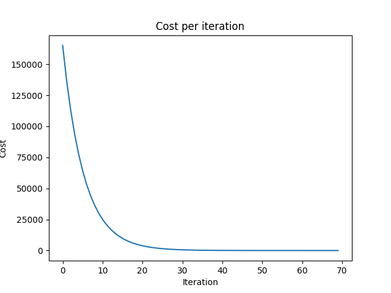

# Gradient-Descent-Visualizer
<b>Gradient Descent Visualizer</b>
  
How to use:
1. Open cmd
2. pip install numpy
3. pip install sklearn
4. pip install matplotlib
5. python gradientDescent(linear).py 
   or python gradientDescent(quadratic).py
 

<b>Linear</b> 

 Cost per iteration 

  

<b>Quadratic</b> 

 Cost per iteration 

  

<b>Momentum Gradient Descent</b> 

  

<b>Nesterov Accelerated Gradient</b> 

