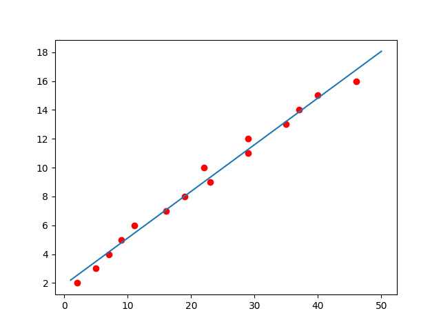
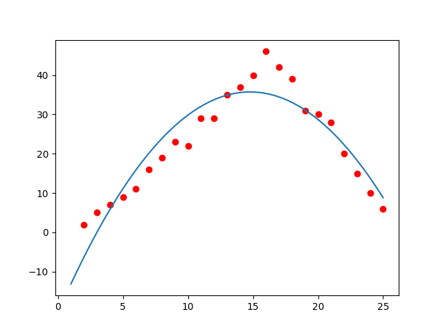

# Linear-Regression-AI
This repository implements Linear Regression and Parabolic Regression from scratch in Python. 
LRwithScikit is Linear Regression implemented by using predefined library "scikit-learn".  
How to use:
1. Open cmd
2. pip install numpy
3. pip install matplotlib
4. pip install sklearn
4. python linearRegression.py 
   or python quadraticRegression.py 
   or python LRwithScikit.py
 

Result:  
Linear: 

 
Quadratic: 

